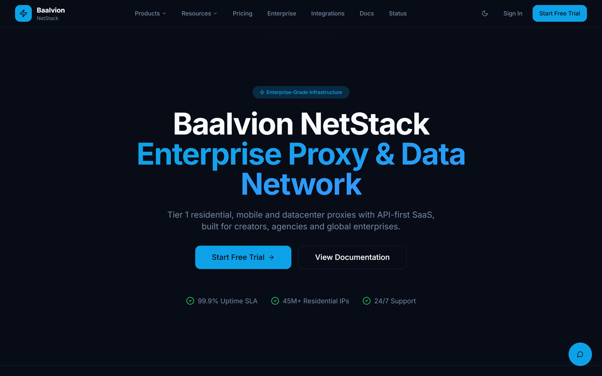

  

# BaalvionStack — Proxy & Data Network

**Enterprise proxy and data-network platform: secure access, scalability, and high-performance operations**

---

## Overview

**BaalvionStack** is the enterprise proxy and data-network product of the Baalvion group. It provides
secure, scalable access to the open web for data-intensive business operations — backed by a
self-serve console for provisioning, usage analytics, and billing.

This repository hosts the **BaalvionStack proxy console** that powers
[proxy.baalvionstack.com](https://proxy.baalvionstack.com).

## ✨ Highlights

- **Secure access at scale** — enterprise-grade proxy and data-network infrastructure
- **Self-serve console** — provisioning, credentials, and access management
- **Usage analytics** — real-time consumption, quotas, and reporting
- **Commerce-ready** — plans, add-ons, and billing via [shop.baalvionstack.com](https://shop.baalvionstack.com)

## 🌐 Live

- Console — [proxy.baalvionstack.com](https://proxy.baalvionstack.com)
- Product — [baalvionstack.com](https://baalvionstack.com)
- Store — [shop.baalvionstack.com](https://shop.baalvionstack.com)

## 🏢 Part of the Baalvion ecosystem

Built and operated by **Baalvion Industries Private Limited**.
Explore the full platform → [baalvion.com](https://baalvion.com) · [@baalvionservice](https://github.com/baalvionservice)

## 📜 License

Proprietary. © 2025–2026 Baalvion Industries Private Limited. All rights reserved. See [LICENSE](./LICENSE).
